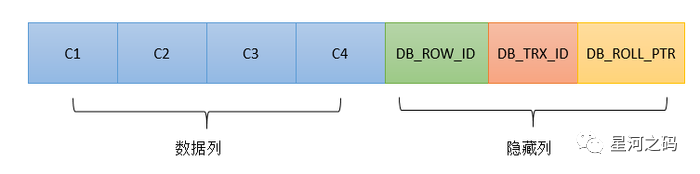
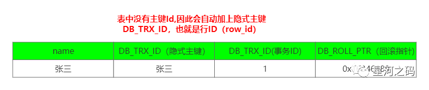
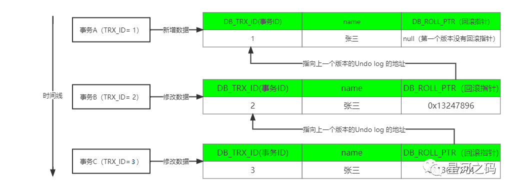

# 多版本并发控制（MVCC）

## 1 简介
数据库通过加锁，可以实现事务的隔离性，串行化隔离级别就是加锁实现的，但是加锁会降低数据库性能。

因此，数据库引入了MVCC多版本并发控制，在读取数据不用加锁的情况下，实现读取数据的同时可以修改数据，修改数据时同时可以读取数据。

MVCC(Mutil-Version Concurrency Control)，多版本并发控制。是一种并发控制的方法，一般在数据库管理系统中，实现对数据库的并发访问。用于支持读已提交(RC）和可重复读(RR）隔离级别的实现。

MVCC在MySQL InnoDB引擎中的实现主要是为了在处理读-写冲突时提高数据库并发性能，记录读已提交和可重复读这两种隔离级别下事务操作版本连的过程。

## 2 用途
MVCC主要是用来解决【读-写】冲突的无锁并发控制，可以解决以下问题：
- 在并发读写数据时，可以做到在读操作时不用阻塞写操作，写操作不用阻塞读操作，提高数据库并发读写的性能。
- 可以解决脏读，幻读，不可重复读等事务隔离问题，但不能解决【写-写】引起的更新丢失问题。

MVCC与锁的组合：

一般数据库中都会采用以上MVCC与锁的两种组合来解决并发场景的问题，以此最大限度的提高数据库性能。

- MVCC + 悲观锁MVCC解决读-写冲突，悲观锁解决写-写冲突。
- MVCC + 乐观锁MVCC解决读-写冲突，乐观锁解决写-写冲突。

通过上述描述，MVCC的作用可以概括为就是为了解决【读写冲突】，提高数据库性能的，而MVCC的实现又依赖于六个概念：【隐式字段】【undo日志】【版本链】【快照读和当前读】【读视图】。

## 3 原理
### 3.1 隐式字段
在InnoDB存储引擎，针对每行记录都有固定的两个隐藏列【DB_TRX_ID】【DB_ROLL_PTR】以及一个可能存在的隐藏列【DB_ROW_ID】。



|隐式字段|描述|是否必须存在|
|--|--|--|
|DB_TRX_ID|事物Id，也叫事物版本号，占用6byte的标识，事务开启之前，从数据库获得一个自增长的事务ID，用其判断事务的执行顺序|是|
|DB_ROLL_PTR|占用7byte，回滚指针，指向这条记录的上一个版本的undo log记录，存储于回滚段（rollback segment）中|是|
|DB_ROW_ID|隐含的自增ID（隐藏主键），如果表中没有主键和非NULL唯一键时，则会生成一个单调递增的行ID作为聚簇索引|否|

> 读者言：DB_TRX_ID这个字段存储的应该是最后一次修改（或插入）本条记录的事务的ID。事务ID在整个数据库中全局唯一，按事务开始时间顺序递增，永不重复。

表中的数据会因此分为两种形式：

- 有主键或唯一非空字段


- 没有主键且没有唯一非空字段



### 3.2 undo日志
一种用于撤销回退的日志，在事务开始之前，会先记录存放到 Undo 日志文件里，备份起来，当事务回滚时或者数据库崩溃时用于回滚事务。undo日志的详细介绍在之前的[《MySQL(七)：一文详解六大日志》](https://mp.weixin.qq.com/s?__biz=MzIxMDU5OTU1Mw==&mid=2247485806&idx=1&sn=ed2de04421546b4187a8bbf9da821648&scene=21#wechat_redirect)中有详细介绍。

undo日志的主要作用是事务回滚和实现MVCC快照读。

undo log日志分为两种：

- insert undo log代表事务在insert新记录时产生的undo log, 仅用于事务回滚，并且在事务提交后可以被立即丢弃。
- update undo log事务在进行update或delete时产生的undo log; 不仅在事务回滚时需要，在实现MVCC快照读时也需要；所以不能随便删除，只有在快速读或事务回滚不涉及该日志时，对应的日志才会被清理线程统一清除。

MVCC实际上是使用的update undo log 实现的快照读。

InnoDB 并不会真正地去开辟空间存储多个版本的行记录，只是借助 undo log 记录每次写操作的反向操作。所以B+ 索引树上对应的记录只会有一个最新版本，InnoDB 可以根据 undo log 得到数据的历史版本，从而实现多版本控制。

### 3.3 版本链
一致性非锁定读是通过 MVCC 来实现的。但是MVCC没有一个统一的实现标准，所以各个存储引擎的实现机制不尽相同。InnoDB 存储引擎中 MVCC 的实现是通过 undo log 来完成的。

当事务对某一行数据进行改动时，会产生一条Undo日志，多个事务同时操作一条记录时，就会产生多个版本的Undo日志，这些日志通过回滚指针（DB_ROLL_PTR）连成一个链表，称为版本链。



只要有事务写入数据时，就会产生一条对应的 undo log，一条 undo log 对应这行数据的一个版本，当这行数据有多个版本时，就会有多条 undo log 日志，undo log 之间通过回滚指针（DB_ROLL_PTR）连接，这样就形成了一个 undo log 版本链。

### 3.4 快照读和当前读
- 快照读【Consistent Read】

    也叫普通读，读取的是记录数据的可见版本，不加锁，不加锁的普通select语句都是快照读，即不加锁的非阻塞读。

    快照读的执行方式是生成 ReadView，直接利用 MVCC 机制来进行读取，并不会对记录进行加锁。

    如下语句：

    ```sql
    select * from table;
    ```

- 当前读

    也称锁定读【Locking Read】，读取的是记录数据的最新版本，并且需要先获取对应记录的锁。如下语句：

    ```sql
    SELECT * FROM student LOCK IN SHARE MODE;  # 共享锁
    SELECT * FROM student FOR UPDATE; # 排他锁
    INSERT INTO student values ...  # 排他锁
    DELETE FROM student WHERE ...  # 排他锁
    UPDATE student SET ...  # 排他锁
    ```

### 3.5 读视图【Read View】
Read View提供了某一时刻事务系统的快照，主要是用来做可见性判断, 里面保存了【对本事务不可见的其他活跃事务】。

当事务在开始执行的时候，会产生一个读视图（Read View），用来判断当前事务可见哪个版本的数据，即可见性判断。

实际上在innodb中，每个SQL语句执行前都会生成一个Read View。

#### 3.5.1 读视图的四个属性
MySQL 5.7源码中对ReadView定义了四个属性，如下：
```c++
class ReadView {
	private:
		/** The read should not see any transaction with trx id >= this
		value. In other words, this is the "high water mark". */
		trx_id_t	m_low_limit_id;

		/** The read should see all trx ids which are strictly
		smaller (<) than this value.  In other words, this is the
		low water mark". */
		trx_id_t	m_up_limit_id;

		/** trx id of creating transaction, set to TRX_ID_MAX for free
		views. */
		trx_id_t	m_creator_trx_id;

		/** Set of RW transactions that was active when this snapshot
		was taken */
		ids_t		m_ids;

		/** The view does not need to see the undo logs for transactions
		whose transaction number is strictly smaller (<) than this value:
		they can be removed in purge if not needed by other views */
		trx_id_t	m_low_limit_no;

		/** AC-NL-RO transaction view that has been "closed". */
		bool		m_closed;

		typedef UT_LIST_NODE_T(ReadView) node_t;

		/** List of read views in trx_sys */
		byte		pad1[64 - sizeof(node_t)];
		node_t		m_view_list;
};
```

- creator_trx_id

    创建当前read view的事务ID

- m_ids

    当前系统中所有的活跃事务的 id，活跃事务指的是当前系统中开启了事务，但还没有提交的事务;

- m_low_limit_id

    表示在生成ReadView时，当前系统中活跃的读写事务中最小的事务id，即m_ids中的最小值。

- m_up_limit_id

    当前系统中事务的 id 值最大的那个事务 id 值再加 1，也就是系统中下一个要生成的事务 id。

---

ReadView 会根据这 4 个属性，结合 undo log 版本链，来实现 MVCC 机制，决定一个事务能读取到数据那个版本。

假设现在有事务 A 和事务 B 并发执行，事务 A 的事务 id 为 10，事务 B 的事务 id 为 20。

事务A的ReadView ：m_ids=[10,20]，m_low_limit_id=10，m_up_limit_id=21，creator_trx_id=10。

事务B的ReadView ：m_ids=[10,20]，m_low_limit_id=10，m_up_limit_id=21，creator_trx_id=20。

#### 3.5.2 读视图可见性判断规则
将Read View中的活跃事务Id按照大小放在坐标轴上表示的话，如下图：


当一个事务读取某条数据时，会通过DB_TRX_ID【Uodo日志的事务Id】在坐标轴上的位置来进行可见性规则判断，如下：

- DB_TRX_ID < m_low_limit_id

    表示DB_TRX_ID对应这条数据【Undo日志】是在当前事务开启之前，其他的事务就已经将该条数据修改了并提交了事务(事务的 id 值是递增的)，所以当前事务【开启Read View的事务】能读取到。

- DB_TRX_ID >= m_up_limit_id

    表示在当前事务【creator_trx_id】开启以后，有新的事务开启，并且新的事务修改了这行数据的值并提交了事务，因为这是【creator_trx_id】后面的事务修改提交的数据，所以当前事务【creator_trx_id】是不能读取到的。

- m_low_limit_id =< DB_TRX_ID < m_up_limit_id

    - DB_TRX_ID  在 m_ids 数组中

        表示DB_TRX_ID【写Undo日志的事务】和当前事务【creator_trx_id】是在同一时刻开启的事务

    - DB_TRX_ID  不等于creator_trx_id

        DB_TRX_ID事务修改了数据的值，并提交了事务，所以当前事务【creator_trx_id】不能读取到。

- DB_TRX_ID  等于creator_trx_id

    表明数据【Undo日志】 是自己生成的，因此是可见的

- DB_TRX_ID  不在 m_ids 数组中

    表示的是在当前事务【creator_trx_id】开启之前，其他事务【DB_TRX_ID】将数据修改后就已经提交了事务，所以当前事务能读取到。

> 读者言：<br />
在RR（可重复读）隔离级别下，事务会在执行第一条SQL语句前获取ReadView，并使用至事务结束。RC（读已提交）级别下，每执行一次SQL语句前，都会重新获取ReadView。<br />
在这两个隔离级别下执行select语句时，会首先读取每条结果数据的最新版本，再根据ReadView和每条结果数据的DB_TRX_ID来判断每条结果数据是否符合要求，若不符合，则会从undo log中依次查找这一条数据的上一个版本。<br />
若某条数据的某个版本的DB_TRX_ID小于ReadView中的最小活跃事务ID，说明此版本是获取到ReadView前存在的版本，可采用此版本。<br />
若某条数据的某个版本的DB_TRX_ID介于最小活跃事务ID（包括），和系统中存在过的最大的事务ID（包括）之间，则继续判断DB_TRX_ID是否属于活跃事务ID，若不属于，则说明此版本是已经被提交的版本，可以采用。若属于，则判断此版本的DB_TRX_ID与当前事务ID是否匹配，若匹配，则说明此版本是由当前事务产生的，可以采用，否则说明此版本是由其他尚未结束的事务产生的，不采用。<br />
若某条数据的某个版本的DB_TRX_ID大于系统中存在过的最大的事务ID（通常只存在于RR隔离级别），则表示此版本是获取到ReadView之后才产生的，一定不属于当前事务，也一定在当前事务执行第一条SQL语句后才产生，故不应采用，否则可能产生不可重复读和幻读。

### 3.6 不同隔离级别MVCC实现原理
通过上述对【Read View】的分析可以总结出：InnoDB 实现MVCC是通过 Read View与Undo Log 实现的，Undo Log 保存了历史快照，形成版本链，Read View可见性规则判断当前版本的数据是否可见。

InnnoDB执行查询语句的具体步骤为：
- 执行语句之前获取查询事务自己的事务Id，即事务版本号。
- 通过事务id获取Read View
- 查询存储的数据，将其事务Id与Read View中的事务版本号进行比较
- 不符合Read View的可见性规则，则读取Undo log中历史快照数据
- 找到当前事务能够读取的数据返回

#### 3.6.1 读已提交（RC）MVCC实现原理
在读已提交(Read committed)的隔离级别下实现MVCC，同一个事务里面，【每一次查询都会产生一个新的Read View副本】，这样可能造成同一个事务里前后读取数据可能不一致的问题（不可重复读并发问题）。

#### 3.6.2 可重复读（RR）MVCC实现原理
在可重复读(Repeatable read)的隔离级别下实现MVCC，【同一个事务里面，多次查询，都只会产生一个共用Read View】，以此不可重复读并发问题。